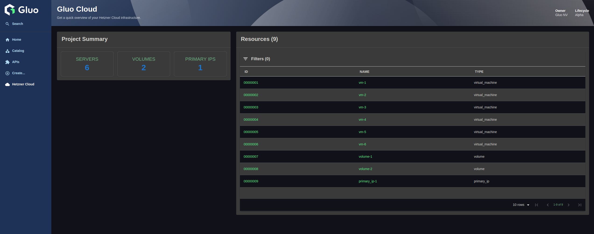

# Hetzner Cloud Frontend Plugin

Welcome to the Hetzner Cloud Frontend Plugin! This plugin visualizes Hetzner Cloud resources in Backstage so it gives insight about Hetzner resources.

## Table of Contents

- [Hetzner Cloud Frontend Plugin](#hetzner-cloud-frontend-plugin)
  - [Table of Contents](#table-of-contents)
  - [Introduction](#introduction)
  - [Functionalities](#functionalities)
  - [Dependencies](#dependencies)
    - [1. Hetzner Cloud Backend Plugin](#1-hetzner-cloud-backend-plugin)
    - [2. Hetzner Cloud Catalog Backend Module](#2-hetzner-cloud-catalog-backend-module)
  - [Quick Start](#quick-start)
    - [Installation](#installation)
  - [Development](#development)
  - [Contributing](#contributing)
  - [License](#license)
    - [Attribution](#attribution)

## Introduction

## Functionalities

The Hetzner Cloud to Backstage plugin needs to give a comprehensive insight into the Hetzner cloud platform.
There are two views that provide information:

- **Index Page**: Gives an overview of the Hetzner Cloud Platform in general.

  

- **Resource Card**: Gives details about which resources are used and what runs where. This view is available in a tab in each component that uses Hetzner's resources.

  

---

## Dependencies

### 1. Hetzner Cloud Backend Plugin

The main Hetzner backend plugin provides the API endpoints and backend logic for Hetzner Cloud integration.  
Repository:  
[https://github.com/gluobe/backstage-plugin-hetzner-backend](https://gitlab.com/gluobe/academy/stages25/backstage-plugin-hetzner-backend/)

### 2. Hetzner Cloud Catalog Backend Module

A backend catalog module is available for importing Hetzner VMs into the Backstage catalog. This module enables the synchronization of Hetzner Cloud resources into the Backstage catalog, making them available for visualization and management.

The backend catalog module can be found at the following repository:

[https://github.com/gluobe/backstage-plugin-hetzner-catalog](https://gitlab.com/gluobe/academy/stages25/backstage-module-hetzner-catalog/)

---

## Quick Start

The following sections will help you get the plugin setup and running.

### Installation

To setup the HetznerCloud frontend you'll need to do the following steps:

1. First we need to add the `@gluo-nv/backstage-plugin-hetzner` package to your frontend app:

   ```sh
   # From your Backstage root directory
   yarn --cwd packages/app add @gluo-nv/backstage-plugin-hetzner
   ```

2. Now open the `packages/app/src/App.tsx` file
3. Then after all the import statements add the following line:

   ```ts
   import { HetznerPage } from '@gluo-nv/backstage-plugin-hetzner';
   ```

4. In this same file just before the closing `</ FlatRoutes>`, this will be near the bottom of the file, add this line:

   ```ts
   <Route path="/hetzner" element={<HetznerPage />} />
   ```

5. Next open the `packages/app/src/components/Root/Root.tsx` file
6. We want to add this icon import after all the existing import statements:

   ```ts
   import Cloud from '@material-ui/icons/Cloud';
   ```

7. Then add this line just before the `</SidebarGroup>` line:

   ```ts
   <SidebarItem icon={Cloud} to="hetzner" text="Hetzner Cloud" />
   ```

8. Add the following `utils.tsx` file in `packages/app/src/components/catalog`:

   ```ts
   import { Entity } from '@backstage/catalog-model';

   export const isHetznerResource = (entity: Entity): boolean => {
     const hetznerData = entity.metadata.annotations?.['hetzner.com/data'];
     try {
       return hetznerData !== undefined && JSON.parse(hetznerData) !== null;
     } catch (e) {
       return false;
     }
   };
   ```

9. Then open the `packages/app/src/components/catalog/EntityPage.tsx` file
10. Add this import statement:

    ```ts
    import { EntityHetznerContent } from '@gluo-nv/backstage-plugin-hetzner';
    import { isHetznerResource } from './utils';
    ```

11. Add the code between the `Hetzner Cloud Plugin` comments:

    ```tsx
    const overviewContent = (
      <Grid container spacing={3} alignItems="stretch">
        {entityWarningContent}
        <Grid item md={6}>
          <EntityAboutCard variant="gridItem" />
        </Grid>
        <Grid item md={6} xs={12}>
          <EntityCatalogGraphCard variant="gridItem" height={400} />
        </Grid>

        {/* Hetzner Cloud Plugin */}
        <EntitySwitch>
          <EntitySwitch.Case
            if={entity =>
              isKind('resource')(entity) && isHetznerResource(entity)
            }
          >
            <Grid item md={6}>
              <EntityHetznerContent />
            </Grid>
          </EntitySwitch.Case>
        </EntitySwitch>
        {/* Hetzner Cloud Plugin */}

        <Grid item md={4} xs={12}>
          <EntityLinksCard />
        </Grid>
        <Grid item md={8} xs={12}>
          <EntityHasSubcomponentsCard variant="gridItem" />
        </Grid>
      </Grid>
    );
    ```

12. Now run `yarn dev` from the root of your project and you should see the HetznerCloud option show up just below Settings in your sidebar and clicking on it will get you to the [Info tab](#info)

## Development

To set up the development environment for the HetznerCloud plugin, follow these steps:

1. Create or update the `dev/index.tsx` file with the following content:

```tsx
import { createDevApp } from '@backstage/dev-utils';
import {
  hetznerCloudPlugin,
  HetznerCloudPage,
  ResourcesCardPage,
} from '../src/plugin';

// dev
import { EntityProvider } from '@backstage/plugin-catalog-react';
import { CustomHetznerAboutCard } from '../src/components/custom/HetznerEntityAboutCard';

// dev
const mockEntity = {
  apiVersion: 'backstage.io/v1alpha1',
  kind: 'Component',
  metadata: {
    name: 'mock-entity',
    annotations: {
      'hetzner.com/data': JSON.stringify({
        id: 12345,
        name: 'vm-gluo-rke2-runner-1',
        status: 'running',
        created: '2024-11-25T10:04:10+00:00',
        public_net: {
          ipv4: {
            ip: '192.168.0.1',
            dns_ptr: 'example.com',
          },
        },
        datacenter: {
          name: 'nbg1-dc3',
          description: 'Nuremberg 1 virtual DC 3',
          location: {
            city: 'Nuremberg',
            country: 'DE',
          },
        },
        server_type: {
          name: 'cx32',
          description: 'CX32',
          cores: 4,
          memory: 8,
          disk: 80,
        },
        image: {
          name: 'debian-12',
          description: 'Debian 12',
          os_flavor: 'debian',
          os_version: '12',
        },
        outgoing_traffic: 12345,
        ingoing_traffic: 67890,
        included_traffic: 100000,
        resource_type: 'virtual_machine',
      }),
    },
  },
};

createDevApp()
  .registerPlugin(hetznerCloudPlugin)
  .addPage({
    element: <HetznerCloudPage />,
    title: 'Root Page',
    path: '/hetzner-cloud',
  })

  // dev
  .addPage({
    title: 'Resources Card',
    element: (
      <EntityProvider entity={mockEntity}>
        <ResourcesCard />
      </EntityProvider>
    ),
    path: '/resources-card',
  })
  .render();
```

This file is the entry point for running the plugin in a standalone development environment. It allows you to test the plugin without integrating it into a full Backstage app.

2. Ensure the `src/routes.ts` file contains the following:

```ts
import { createRouteRef } from '@backstage/core-plugin-api';

export const rootRouteRef = createRouteRef({
  id: 'hetzner-cloud',
});

// dev
export const resourcesCardRouteRef = createRouteRef({
  id: 'resources-card',
});
```

This file defines the route references for the plugin. Route references are used to link components to specific paths in Backstage.

3. Ensure the `src/plugin.ts` file contains the following:

```ts
import {
  createPlugin,
  createRoutableExtension,
} from '@backstage/core-plugin-api';

import { resourcesCardRouteRef, rootRouteRef } from './routes';

export const hetznerCloudPlugin = createPlugin({
  id: 'hetzner-cloud',
  routes: {
    root: rootRouteRef,
    resourcesCard: resourcesCardRouteCard, //dev
  },
});

// prod
// export const EntityHetznerCloudContent = hetznerCloudPlugin.provide(
//   createComponentExtension({
//     component: {
//       lazy: () => import ('./components/entity/ResourcesCard').then(m => m.ResourcesCard),
//     }
//   })
// );

export const HetznerCloudPage = hetznerCloudPlugin.provide(
  createRoutableExtension({
    name: 'HetznerCloudPage',
    component: () =>
      import('./components/IndexComponent').then(m => m.IndexComponent),
    mountPoint: rootRouteRef,
  }),
);

// dev
export const ResourcesCardPage = hetznerCloudPlugin.provide(
  createRoutableExtension({
    name: 'ResourcesCardPage',
    component: () =>
      import('./components/entity/ResourcesCard').then(m => m.ResourcesCard),
    mountPoint: resourcesCardRouteRef,
  }),
);
```

This file defines the main plugin and its extensions. It connects the plugin's routes to their corresponding components.

4. Ensure the `src/index.ts` file contains the following:

```ts
export {
  hetznerCloudPlugin,
  HetznerCloudPage,
  ResourcesCardPage, //dev
} from './plugin';
```

This file exports the plugin and its extensions so they can be imported and used in other parts of the application.

---

## Contributing

We welcome contributions to improve this plugin! If you’d like to contribute, please follow these steps:

1. Fork the repository.
2. Create a new branch for your feature or bug fix.
3. Submit a pull request with a clear description of your changes.

For major changes, please open an issue first to discuss your ideas.

---

## License

This plugin is licensed under the GNU Affero General Public License v3.0 (AGPL-3.0).

### Attribution

This plugin was created by [Gluo NV](https://gluo.be).  
Any use or distribution must include proper attribution to the original author.
